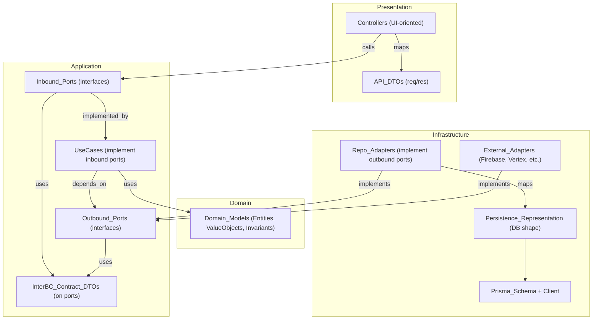

# Backend architecture (MVP) — rules of the road

Purpose: a **single-container modular monolith** (NestJS) with **split-ready** bounded contexts. Treat this document as **restrictions** for future code generation.

## Bounded contexts (modules)
Each module maps 1:1 to `Plan/02_architecture/03_bounded_contexts_mvp.md`:
- IdentityAccess
- CandidateProfile
- Organization
- Billing
- JobQuestionKit
- MatchingRanking
- InvitationsAutomation
- QASession
- CandidatePacket

Cross-cutting (not bounded contexts):
- Notifications
- Audit

## Layers (clean/onion)
- Presentation: controllers (UI-oriented; “BFF” terminology only), API request/response DTOs, validation, auth guards
- Application: use-cases + ports (interfaces) + inter-BC contract DTOs (public surface)
- Domain: entities/value objects/invariants (no framework, no DB, no ports)
- Infrastructure: Prisma persistence + repositories + external adapters (Firebase/Vertex/SendGrid/etc.)

## Allowed dependencies (direction)
- Presentation → Application
- Application → Domain
- Infrastructure → Application (implements outbound ports)
- Infrastructure → Domain (mapping)
- Domain → (nothing)

No cross-BC imports except via **Application ports + contract DTOs**.

## Models (4 types) and where they live
- Domain models: `domain/`
- Persistence representation (Prisma + mapping): `infrastructure/`
- API/BFF DTOs (HTTP): `presentation/`
- Inter-BC contract DTOs (ports): `application/`

Rule: **use-cases operate on domain entities**. DTOs exist only at boundaries (HTTP, BC-to-BC).

## Inter-BC communication (sync ports)
- Calls between BCs go through **Application-layer ports** (TypeScript interfaces).
- No direct access to another BC’s repositories/DB models/infrastructure.
- No internal event bus abstraction.
- Port/contract governance:
  - Ports must be minimal and use-case oriented.
  - Ports must expose/accept **contract DTOs** only (no domain entities).
Note: async workflows use Pub/Sub (see “Async work + scheduling”).

## Database boundaries (MVP)
- One Postgres database (Cloud SQL).
- Split by conventions (table naming + code ownership).
- No joins across bounded contexts.
- Only the owning BC can read/write its tables (via its repositories).

## AuthN / AuthZ
- AuthN/AuthZ details are defined in `Plan Pro/02_architecture/authentication_authorization.md` (placeholder; to be completed).

## Codebase layout + enforcement
- Top-level layout follows the layer structure per bounded context:
  - `src/bounded-contexts/<BoundedContextName>/{domain,application,infrastructure,presentation}/...`
- Import rules are defined by the “Allowed dependencies” and “No cross-BC imports except ports/contracts” restrictions in this document.
- Enforcement (lint/tsconfig boundaries) may be added later; violations should be treated as bugs.
- Naming conventions:
  - Prefer clarity over brevity.
  - Names should reflect intent and responsibility (SRP).

## API basics (global)
- No API versioning for now (single deployment).
- OpenAPI-first: backend maintains and publishes an OpenAPI spec used for typed client generation in the frontend.
- Clarification: HTTP API versioning is deferred; async events are versioned (see `Plan Pro/02_architecture/integration_contracts.md`).
- Errors:
  - Use HTTP status codes for error family.
  - Response body is a simple object:
    - `subcode` (stable machine-readable identifier)
    - `message` (human-readable)
- Pagination/sorting conventions: deferred until needed.
- ID format (UUID vs ULID): TBD.

TODO (major, to decide soon):
- Decide ID format (UUID vs ULID) and standardize across DB/API/events.
- Define an initial error `subcode` taxonomy (namespace + core codes).
- Define audit logging minimum fields and capture points (cross-cutting module).

## Security baseline (global)
- AuthN/AuthZ details: deferred (see `Plan Pro/02_architecture/authentication_authorization.md`).
- CORS: same-origin with the frontend; no special handling expected.
- Rate limiting and request size limits: deferred until needed.

## Configuration + secrets
- No separate environments for now, but follow best practices:
  - No hardcoded configuration in code.
  - Configuration must be injected via environment variables (Cloud Run).
  - Secrets must come from Secret Manager (not committed to repo).
  - Validate required configuration on startup; fail fast if missing/invalid.

## Async work + scheduling (infrastructure pattern)
- Pub/Sub is the external event bus.
- Each bounded context subscribes to the topics it needs and processes events independently.
- Event handlers must call Application use-cases (same layering rules as HTTP controllers).
- Background processing runs in the same monolith container (no separate worker deployment for now).
- Handler placement rule:
  - Pub/Sub subscription handlers live in `infrastructure/` as thin adapters.
  - Handlers delegate to `application/` use-cases and do not contain domain logic.

## Observability
- Structured logs (JSON).
- Every log entry must include: `bounded_context`, `use_case`, and either `request_id` (HTTP) or `event_id` (async).
- Errors must include: `subcode` and `message` (aligned with API error format).
- Do not log PII by default; prefer stable IDs and high-level metadata.

## Transactions + consistency
- Transaction boundaries are confined to a single bounded context (only its tables).
- Avoid cross-BC DB transactions and cross-BC joins.
- Cross-BC consistency is achieved via:
  - synchronous port calls (contract DTOs), and/or
  - async Pub/Sub workflows owned by the consuming BC.

## Migrations + schema ownership
- One Postgres schema, but each BC owns its tables by convention.
- Migrations are reviewed for BC ownership and boundary violations.
- Do not introduce foreign keys that force cross-BC joins; cross-BC references are stored as opaque IDs.

## Diagram (layers + model packages)

