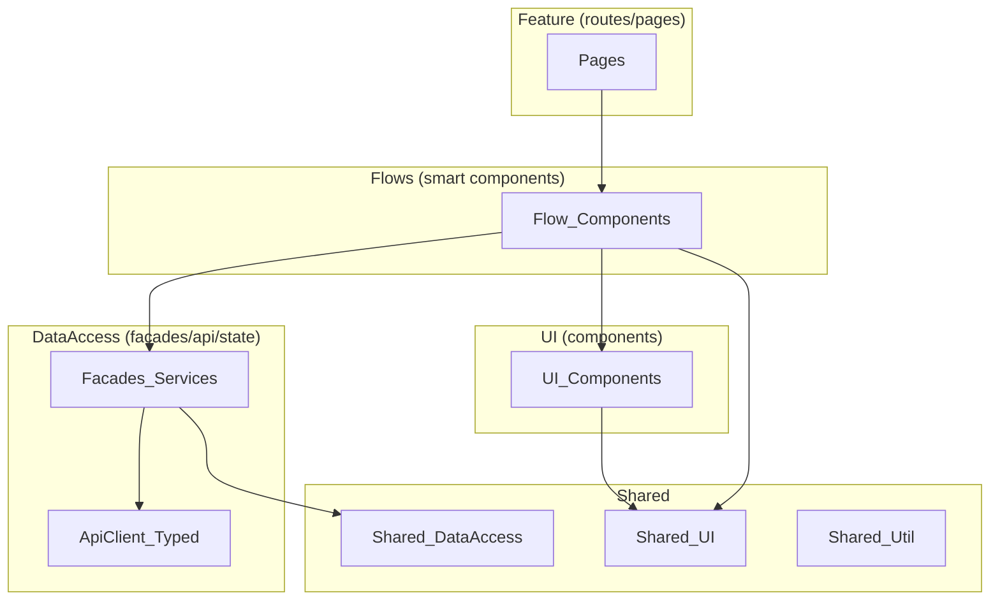

# Frontend architecture (MVP) — rules of the road

Purpose: Angular SPA organized by **portals** with clear feature boundaries. Treat this document as **restrictions** for future UI code generation.

## Product areas
- Candidate portal
- Employer portal
- Admin portal

## Core decisions (locked)
- Framework: **Angular (TypeScript)**, SPA (CSR).
- AuthN: **Firebase Auth** in the browser.
- Hosting: same-origin static hosting (GCS + CDN/LB); backend is accessed under the same origin.

## Structure (feature boundaries)
At this stage, avoid committing to overly rigid frontend structuring decisions. We do not expect a future need for micro-frontends aligned with backend bounded contexts. A coarse-grained, portal-based UI split (candidate/employer/admin) is the preferred starting point.

Recommended structure (default; may evolve):
- One Angular app, split by portal:
  - `src/app/candidate/*`
  - `src/app/employer/*`
  - `src/app/admin/*`
- Shared packages:
  - `src/app/shared/ui/*`
  - `src/app/shared/data-access/*`
  - `src/app/shared/util/*`

Within each portal, group by workflow/capability (not backend BCs):
- `.../feature/*` (routes/pages)
- `.../flows/*` (flow-based, “smart” components)
- `.../ui/*` (UI components; may be smart or presentational depending on complexity)
- `.../data-access/*` (facades/services + API clients)

## Dependency rules (direction)
- `feature`/`flows`/portal `ui` → may depend on portal `data-access` and `shared/*`.
- No component uses `HttpClient` directly.
- All network access goes through `data-access` facades/services.
- `shared/ui` is presentational; it must not import portal `data-access`.
- Prefer duplication over tight coupling in MVP; cross-portal reuse goes through `shared/*`.

## UI component library (default)
Default choice: **PrimeNG** (theme + skinned components for a unique look).

Styling approach:
- Use a PrimeNG theme as a baseline, then apply Jobarium brand tokens (colors/typography/spacing).
- Wrap and skin commonly used primitives in `shared/ui` to keep consistent styling and limit PrimeNG leakage.

## CSS / styling approach
- Default style language: **SCSS**.
- Prefer component-scoped styles; keep global CSS limited to tokens, typography, and layout primitives.
- Define Jobarium design tokens as CSS variables (`:root`) and use them consistently (including PrimeNG overrides).
- Token/override file locations (convention):
  - `src/styles/tokens.scss`
  - `src/styles/primeng-overrides.scss`
- PrimeNG customization policy:
  - Prefer wrapping/skinning via `shared/ui`.
  - Keep global overrides in a dedicated place (avoid scattered deep selectors).

## State management (default)
Default choice: **Signals + services/facades** (keep it simple).
- Local component state stays local.
- Backend/data orchestration state lives in `data-access` facades/services.
- UI-only workflow state may live in `flows` components or in a workflow-local store/service.
- Avoid global stores unless proven necessary.

Rule of thumb:
- Start with component + `data-access` facade.
- Introduce a workflow-local store/service only when the workflow state/orchestration becomes non-trivial or shared across components.

## Domain logic in the frontend
- Frontend should know as little as possible about pure domain logic.
- Frontend should operate on backend **use cases** and **DTOs** (application-level contracts), not domain entities.
- Business rules live in the backend; frontend implements UI-local rules only (form validation, presentation logic).

## Forms
- Use **Reactive Forms** for complex/large editing workflows (for example resume/profile editing).
- Signals are still used for non-form state (loading flags, UI state, derived view state).

## API access (default)
Default choice: **typed API client generated from OpenAPI**.
- HTTP calls live in `data-access`.
- Do not call HTTP directly from components/pages; call facades/services.
- OpenAPI-first: the backend maintains an OpenAPI spec; the frontend generates the typed client from it from day one.
- TODO: define the OpenAPI generation workflow (where it runs, how generated client code is managed, CI expectations).
- Convention: generated client code lives under `shared/data-access/generated/` and must not be hand-edited.

## Auth integration (browser)
- Firebase Auth handles sign-in/out and token lifecycle in the browser.
- Frontend attaches the Firebase ID token to API calls via an HTTP interceptor (`Authorization: Bearer <token>`).
- After login, frontend loads an application-level bootstrap DTO from the backend (for example `GET /me` or `/me/bootstrap`).
  - Route guards use this DTO (roles/portal access flags) for navigation and gating.
  - Authorization enforcement remains in the backend business logic.

## Routing + lazy loading
- Lazy load by portal; the app is not expected to load multiple portals in one session.
- Primary routes:
  - `/auth` (entry route): handles sign-in flow and redirects to the appropriate portal start route.
  - `/candidate/*`, `/employer/*`, `/admin/*` (lazy-loaded route trees).
- `/auth` behavior: if already authenticated, fetch `/me` bootstrap DTO and redirect to the appropriate portal home.
- Guards are layered:
  - authentication (session present)
  - portal access (based on backend `/me` bootstrap DTO)

## Error handling (global)
- Backend errors follow `{ subcode, message }`.
- Frontend should surface user-friendly messages and retain `subcode` for debugging.

UI reaction policy:
- Prefer local handling close to where the error occurs.
- Inline error (in-component) for recoverable, contextual errors (validation, failed load/save for a specific panel).
- Toast/notification for transient or cross-cutting events (network blips, background refresh failures).
- Redirect/navigation only for global/structural cases:
  - unauthenticated/expired session → route to sign-in
  - forbidden → show a dedicated “Access denied” view (no automatic loops)
  - not found (route-level) → 404 page
  - unexpected fatal (route-level) → generic error page with retry/back action
- Do not show raw backend messages to users unless explicitly reviewed; map known `subcode`s to friendly copy.

## Configuration
- No hardcoded environment values in code.
- Because the app is statically hosted, there are no runtime environment variables available in the browser.
- Inject config at deploy time via a generated artifact (for example `assets/config.json` loaded on startup).
- Config includes only non-secret values (API base URL, Firebase public config). Do not store secrets in the frontend.

## Internationalization (foundation)
- App is expected to be localized in the future.
- Use locale-aware formatting for dates/numbers/currency (avoid manual string formatting).
- Avoid string concatenation for user-visible copy where possible (prefer templates that can be translated later).
- TODO: choose and standardize the localization approach (compile-time Angular i18n vs runtime translation library) before large amounts of UI copy accumulate.

## Diagram (layers inside the frontend)
Note: `shared/util` may be used from any layer; it is intentionally omitted from the diagram edges for readability.

