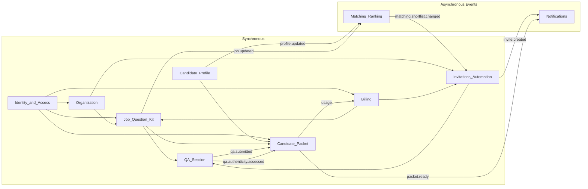

# Bounded Context Interfaces — Conceptual View

## Purpose

Interfaces between the nine BCs: interaction points, external keys, sync vs async. Event contracts: [14_event_contracts_registry.md](14_event_contracts_registry.md).

---

## 1. Main interaction points between BCs

Interaction points are derived from [user stories](../01_product/10_user_stories_mvp.md) and [architecture flow](02_jobarium_architecture_plan.md#high-level-flow).

### 1.1 Identity & Access → all

- **What:** Auth (who is the principal, roles, consent).
- **Stories:** Every story (E-01–E-06, C-01–C-05, A-01–A-02) assumes an authenticated user; GDPR (A-02) and consent (C-05) touch consent records.
- **Nature:** Every request validates token/session and resolves principal; RBAC checks before sensitive operations. No domain events; pure synchronous API/lookup.

### 1.2 Candidate Profile ↔ Matching & Ranking

- **Profile → Matching:** After profile create/update or enrichment, Matching must refresh scores and shortlist.
- **Stories:** C-01 (profile bootstrap), C-02 (matchable profile).
- **Interaction:** Candidate Profile publishes `profile.updated` and (from enrichment) `candidate.enrichment.completed`; Matching subscribes and recomputes match/shortlist. Async (event-driven).

### 1.3 Organization ↔ Job, Invitations, Packet

- **Org → Job:** Job creation/activation requires valid org and membership (sync: Organization is source of tenant and membership).
- **Stories:** E-01 (job setup).
- **Interaction:** Synchronous: "does this user belong to this org?", "is this org active?". Job and Invitations resolve org context via Organization.

### 1.4 Billing ↔ Job, Invitations, Packet

- **Billing → Job, Invitations:** Plan/limit checks (e.g. active jobs, invite caps) at decision time.
- **Stories:** E-01 (job setup), E-03 (invite caps).
- **Interaction:** Synchronous: "can this billable party create another job?", "what are invite caps?". Billing is the source of limits; Job and Invitations call it (or cached copy). Billable party may be organization or user depending on future model.
- **Packet → Billing:** When a packet becomes ready, usage is incremented (packets_generated). Async: `packet.ready` consumed by Billing; optionally also invite usage (invites_sent) from Invitations.

### 1.5 Job & Question Kit → Matching, Invitations, Q&A, Packet

- **Job → Matching:** Job create/update/activation triggers shortlist recompute.
- **Stories:** E-01, E-02 (dealbreakers in job requirements).
- **Interaction:** Job publishes `job.updated`; Matching subscribes. Async.
- **Job → Invitations:** Invite policy (caps, cooldowns) and job context (role, company) needed to create and send invites. Invitations holds invite policy; job data (title, org name, etc.) is read when building invite content — sync read or cached.
- **Job → Q&A:** Question kit (questions, options) is required to run a Q&A session. When candidate starts/continues Q&A, Q&A Session needs the kit. Sync read from Job & Question Kit (or replicated read model keyed by job_id).
- **Job → Packet:** Packet is "candidate + job + session"; packet builder needs job metadata and dealbreakers for summary. Sync read or event payload.

### 1.6 Matching & Ranking → Invitations & Automation

- **What:** When shortlist changes, newly entered candidates may be auto-invited.
- **Stories:** E-03 (automation guardrails), C-03 (invite transparency).
- **Interaction:** Matching publishes `matching.shortlist.changed` (with `entered_candidates`, `exited_candidates`); Invitations subscribes, applies caps/cooldowns, creates invites. Async.

### 1.7 Invitations & Automation → Q&A Session, Notifications

- **Invitations → Q&A:** An invite is the gateway to a Q&A session; session is created/linked by `invite_id`. When candidate clicks "Start," Q&A Session resolves invite (valid, not expired) and loads question kit. Sync: resolve invite and optionally create session.
- **Invitations → Notifications:** Sending the invite (email/SMS). Async: `invite.created` (or similar) triggers notification adapter.

### 1.8 Q&A Session → Candidate Packet, Notifications

- **What:** Submitted Q&A drives packet build and authenticity; reminders are notifications.
- **Stories:** C-04 (Q&A completion), E-04–E-06 (packet review, authenticity).
- **Interaction:** Q&A Session publishes `qa.submitted`; Candidate Packet (and authenticity pipeline) subscribe. After authenticity: `qa.authenticity.assessed` to Packet. Async. Reminders: Q&A or scheduler triggers Notifications (async).

### 1.9 Candidate Packet → Billing, Notifications

- **Packet → Billing:** Packet ready increments `packets_generated` (and possibly other usage). Async via `packet.ready` or internal usage API.
- **Packet → Notifications:** "Packet ready" notification to employer. Async.
- **Employer actions:** E-05 (one-click decision). Sync: record `packet_action` in Candidate Packet; caller is employer UI (already authorized via Identity & Access and Organization membership).

### 1.10 Candidate Profile → Candidate Packet (read)

- **What:** Packet builder needs profile data (summary, skills, experience) to build packet content.
- **Interaction:** When building packet, Candidate Packet reads profile (and Q&A, job) — sync read or data passed in event payload to avoid N+1.

### 1.11 Cross-cutting: Notifications and Audit

- **Notifications:** Invitations (invite send), Q&A (reminders), Packet (packet ready), optionally Identity (verification). Called by BCs; not a BC. Sync call or async via event.
- **Audit:** Many BCs write audit entries (who did what). Shared capability; sync append (or async with ordering guarantees).

---

## 2. Data overlap (logical external keys)

BCs reference other BCs only by IDs (logical FKs); no full aggregate copies.

| Owning BC | Key | Referenced by (and how) |
|-----------|-----|--------------------------|
| **Identity & Access** | `user_id` | All: principal for auth. Candidate Profile (candidate = user), Organization (org member), Packet (`actor_user_id` in packet_action). |
| **Identity & Access** | (optional) `tenant_id` | If used, same as `organization_id` for employer scope. |
| **Candidate Profile** | `candidate_id` | Matching (`match_score`, `job_shortlist`), Invitations (`invite`), Q&A (`qa_session`), Packet (`candidate_packet`). Often same as `user_id` for candidates. |
| **Organization** | `organization_id` | Job (`job_posting`), Invitations (tenant context), Packet, Matching indirectly via Job. |
| **Billing** | (billable party) | Subscription/usage may be keyed by `organization_id` and/or `user_id`; Job, Invitations, Packet call Billing for limits and usage. |
| **Job & Question Kit** | `job_id` | Matching (`match_score`, `job_shortlist`), Invitations (`invite`), Q&A (session → invite → job), Packet (`candidate_packet`). |
| **Job & Question Kit** | `job_question_kit_id` / `question_id` | Q&A Session (which questions to show, which answers map to which question). |
| **Matching & Ranking** | — | Does not expose stable "match_id" to others; shortlist is referenced by (job_id, candidate_id). Invitations consumes events, not long-lived FK. |
| **Invitations & Automation** | `invite_id` | Q&A Session (`qa_session.invite_id`): session is created from invite. |
| **Q&A Session** | `session_id` | Candidate Packet (`candidate_packet.session_id`): packet is built from one session. |
| **Candidate Packet** | `packet_id` | Packet actions reference packet; Billing may reference for usage idempotency (e.g. in event payload). |

**Internal to Candidate Profile:** `document_id`, `parse_job_id` — no other BC references. Event-derived data is eventually consistent; reads may use caches or sync with owning BC.

---

## 3. Sync vs async

**Sync:** Auth, read-your-writes, limit checks (Billing), invite resolve + session create, packet actions, single-action reads (e.g. packet build data).

**Async (events):** Profile/job → matching; shortlist → invites; document lifecycle; Q&A → packet + authenticity; packet ready → notifications + Billing usage.

### Diagram (high level)

---

Event naming and BC mapping: [14_event_contracts_registry.md](14_event_contracts_registry.md), [03_bounded_contexts_mvp.md](03_bounded_contexts_mvp.md). Future API specs: assign endpoints to sync read, sync command, or event producer/consumer.
