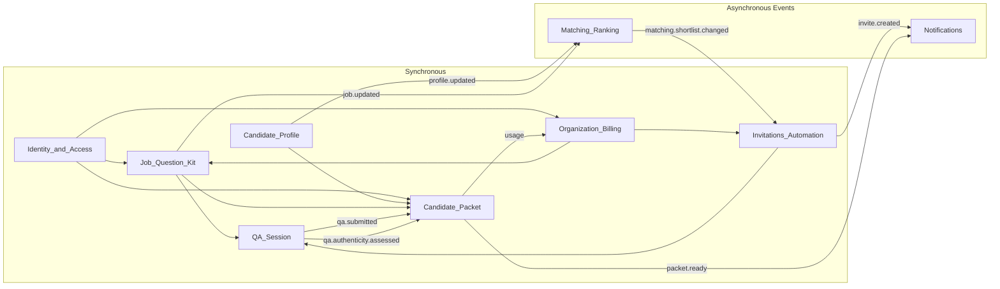

# Bounded Context Interfaces — Conceptual View

## Purpose

Summarize interfaces between the eight bounded contexts: main interaction points (from user stories and workflow), overlapping data (logical external keys), and synchronous vs asynchronous communication. Detailed event contracts live in [14_event_contracts_registry.md](14_event_contracts_registry.md).

---

## 1. Main interaction points between BCs

Interaction points are derived from [user stories](../01_product/10_user_stories_mvp.md), the [architecture flow](02_jobarium_architecture_plan.md#high-level-flow), and the [context map](03_bounded_contexts_mvp.md#context-map-summary).

### 1.1 Identity & Access → all

- **What:** Auth (who is the principal, roles, consent).
- **Stories:** Every story (E-01–E-06, C-01–C-05, A-01–A-02) assumes an authenticated user; GDPR (A-02) and consent (C-05) touch consent records.
- **Nature:** Every request validates token/session and resolves principal; RBAC checks before sensitive operations. No domain events; pure synchronous API/lookup.

### 1.2 Candidate Profile ↔ Matching & Ranking

- **Profile → Matching:** After profile create/update or enrichment, Matching must refresh scores and shortlist.
- **Stories:** C-01 (profile bootstrap), C-02 (matchable profile).
- **Interaction:** Candidate Profile publishes `profile.updated` and (from enrichment) `candidate.enrichment.completed`; Matching subscribes and recomputes match/shortlist. Async (event-driven).

### 1.3 Organization & Billing ↔ Job, Invitations, Packet

- **Org → Job:** Job creation/activation requires valid org and membership; plan/limit checks (e.g. active jobs).
- **Stories:** E-01 (job setup), E-03 (invite caps).
- **Interaction:** Synchronous: "can this org create/activate this job?", "what are invite caps for this org?". Organization & Billing is the source of limits; Job and Invitations call it (or cached copy) at decision time.
- **Packet → Billing:** When a packet becomes ready, usage is incremented (packets_generated). Async: `packet.ready` consumed by billing/usage logic; optionally also invite usage (invites_sent) from Invitations.

### 1.4 Job & Question Kit → Matching, Invitations, Q&A, Packet

- **Job → Matching:** Job create/update/activation triggers shortlist recompute.
- **Stories:** E-01, E-02 (dealbreakers in job requirements).
- **Interaction:** Job publishes `job.updated`; Matching subscribes. Async.
- **Job → Invitations:** Invite policy (caps, cooldowns) and job context (role, company) needed to create and send invites. Invitations holds invite policy; job data (title, org name, etc.) is read when building invite content — sync read or cached.
- **Job → Q&A:** Question kit (questions, options) is required to run a Q&A session. When candidate starts/continues Q&A, Q&A Session needs the kit. Sync read from Job & Question Kit (or replicated read model keyed by job_id).
- **Job → Packet:** Packet is "candidate + job + session"; packet builder needs job metadata and dealbreakers for summary. Sync read or event payload.

### 1.5 Matching & Ranking → Invitations & Automation

- **What:** When shortlist changes, newly entered candidates may be auto-invited.
- **Stories:** E-03 (automation guardrails), C-03 (invite transparency).
- **Interaction:** Matching publishes `matching.shortlist.changed` (with `entered_candidates`, `exited_candidates`); Invitations subscribes, applies caps/cooldowns, creates invites. Async.

### 1.6 Invitations & Automation → Q&A Session, Notifications

- **Invitations → Q&A:** An invite is the gateway to a Q&A session; session is created/linked by `invite_id`. When candidate clicks "Start," Q&A Session resolves invite (valid, not expired) and loads question kit. Sync: resolve invite and optionally create session.
- **Invitations → Notifications:** Sending the invite (email/SMS). Async: `invite.created` (or similar) triggers notification adapter.

### 1.7 Q&A Session → Candidate Packet, Notifications

- **What:** Submitted Q&A drives packet build and authenticity; reminders are notifications.
- **Stories:** C-04 (Q&A completion), E-04–E-06 (packet review, authenticity).
- **Interaction:** Q&A Session publishes `qa.submitted`; Candidate Packet (and authenticity pipeline) subscribe. After authenticity: `qa.authenticity.assessed` to Packet. Async. Reminders: Q&A or scheduler triggers Notifications (async).

### 1.8 Candidate Packet → Organization & Billing, Notifications

- **Packet → Billing:** Packet ready increments `packets_generated` (and possibly other usage). Async via `packet.ready` or internal usage API.
- **Packet → Notifications:** "Packet ready" notification to employer. Async.
- **Employer actions:** E-05 (one-click decision). Sync: record `packet_action` in Candidate Packet; caller is employer UI (already authorized via Identity & Access and org membership).

### 1.9 Candidate Profile → Candidate Packet (read)

- **What:** Packet builder needs profile data (summary, skills, experience) to build packet content.
- **Interaction:** When building packet, Candidate Packet reads profile (and Q&A, job) — sync read or data passed in event payload to avoid N+1.

### 1.10 Cross-cutting: Notifications and Audit

- **Notifications:** Invitations (invite send), Q&A (reminders), Packet (packet ready), optionally Identity (verification). Called by BCs; not a BC. Sync call or async via event.
- **Audit:** Many BCs write audit entries (who did what). Shared capability; sync append (or async with ordering guarantees).

---

## 2. Data overlap between contexts (logical external keys)

Each BC owns a set of entities; other BCs reference them by **logical foreign keys** (IDs). No BC stores a full copy of another BC's aggregate; they store only the IDs needed for integration and lookup.

| Owning BC | Key | Referenced by (and how) |
|-----------|-----|--------------------------|
| **Identity & Access** | `user_id` | All: principal for auth. Candidate Profile (candidate = user), Organization & Billing (org member), Packet (`actor_user_id` in packet_action). |
| **Identity & Access** | (optional) `tenant_id` | If used, same as `organization_id` for employer scope. |
| **Candidate Profile** | `candidate_id` | Matching (`match_score`, `job_shortlist`), Invitations (`invite`), Q&A (`qa_session`), Packet (`candidate_packet`). Often same as `user_id` for candidates. |
| **Organization & Billing** | `organization_id` | Job (`job_posting`), Invitations (tenant + limit checks), Packet (usage by org), Matching indirectly via Job. |
| **Job & Question Kit** | `job_id` | Matching (`match_score`, `job_shortlist`), Invitations (`invite`), Q&A (session → invite → job), Packet (`candidate_packet`). |
| **Job & Question Kit** | `job_question_kit_id` / `question_id` | Q&A Session (which questions to show, which answers map to which question). |
| **Matching & Ranking** | — | Does not expose stable "match_id" to others; shortlist is referenced by (job_id, candidate_id). Invitations consumes events, not long-lived FK. |
| **Invitations & Automation** | `invite_id` | Q&A Session (`qa_session.invite_id`): session is created from invite. |
| **Q&A Session** | `session_id` | Candidate Packet (`candidate_packet.session_id`): packet is built from one session. |
| **Candidate Packet** | `packet_id` | Packet actions reference packet; Billing/usage may reference for idempotency (e.g. in event payload). |

**Document/parse:** `document_id`, `parse_job_id` are internal to Candidate Profile (or parser worker owned by that BC). Other BCs do not reference them.

**Summary:** The main external keys that cross BC boundaries are `user_id`, `organization_id`, `candidate_id`, `job_id`, `invite_id`, `session_id`, `packet_id`. Consistency is eventual where data is derived from events; read paths may use caches or sync reads with the owning BC.

---

## 3. Synchronous vs asynchronous communication

Guideline from the [context map](03_bounded_contexts_mvp.md#context-map-summary): *event-driven (Pub/Sub) for async flows; API/synchronous for auth, read-your-writes, and immediate user actions.*

### 3.1 Prefer synchronous

- **Auth and authorization:** Resolve principal, roles, consent. Every request; low latency required.
- **Read-your-writes:** Right after "create job" or "update profile," the UI shows the new state. Either same service or sync read from owning BC.
- **Limit and policy checks:** "Can this org create another job?", "Can we send another invite for this job?" — answered at request time from Organization & Billing (or cached).
- **Resolving an invite to start Q&A:** Candidate clicks link; backend validates invite and returns question kit (sync read of Job) and creates/returns session.
- **Employer packet actions:** Interview / Clarify / Reject written to Candidate Packet; response returned to UI.
- **Reading data needed for a single user action:** e.g. Packet builder reading profile + job + session for one packet (can be sync or pre-aggregated in event payload).

### 3.2 Prefer asynchronous (events / Pub/Sub)

- **Profile or job changes → matching:** `profile.updated`, `job.updated`, `candidate.enrichment.completed` → Matching recomputes and publishes `matching.shortlist.changed`. No need to block the user.
- **Shortlist → invites:** `matching.shortlist.changed` → Invitations (caps, cooldowns, create invite) → `invite.created` → Notifications. Fully async.
- **Document lifecycle:** `candidate.document.uploaded` → parser; `candidate.document.parsed` → enrichment / profile update. Async.
- **Q&A submitted → packet and authenticity:** `qa.submitted` → Candidate Packet (build) and authenticity pipeline; `qa.authenticity.assessed` → Packet finalization. Async.
- **Packet ready → notifications and usage:** `packet.ready` → Notifications (employer), Organization & Billing (usage). Async.
- **Usage/billing:** `billing.usage.updated` or usage implied by `packet.ready` / invite creation. Async.

### 3.3 Diagram (high level)

---

## 4. Alignment with existing docs

- **Events:** All async interactions above align with [14_event_contracts_registry.md](14_event_contracts_registry.md) (E-01–E-13); producers/consumers map to the BCs in [03_bounded_contexts_mvp.md](03_bounded_contexts_mvp.md).
- **Context map:** The upstream/downstream table in the bounded contexts doc is preserved; this doc adds the "sync vs async" and "external keys" view on top of it.
- **User stories:** E-01–E-06, C-01–C-05, and A-01–A-02 are covered by the interaction points above without introducing new BCs.

---

## 5. API specs (future)

When adding detailed API specs, assign each endpoint to one of these interaction patterns: **sync read**, **sync command**, or **event producer/consumer**. See sections 3.1 and 3.2 for when to use each.
