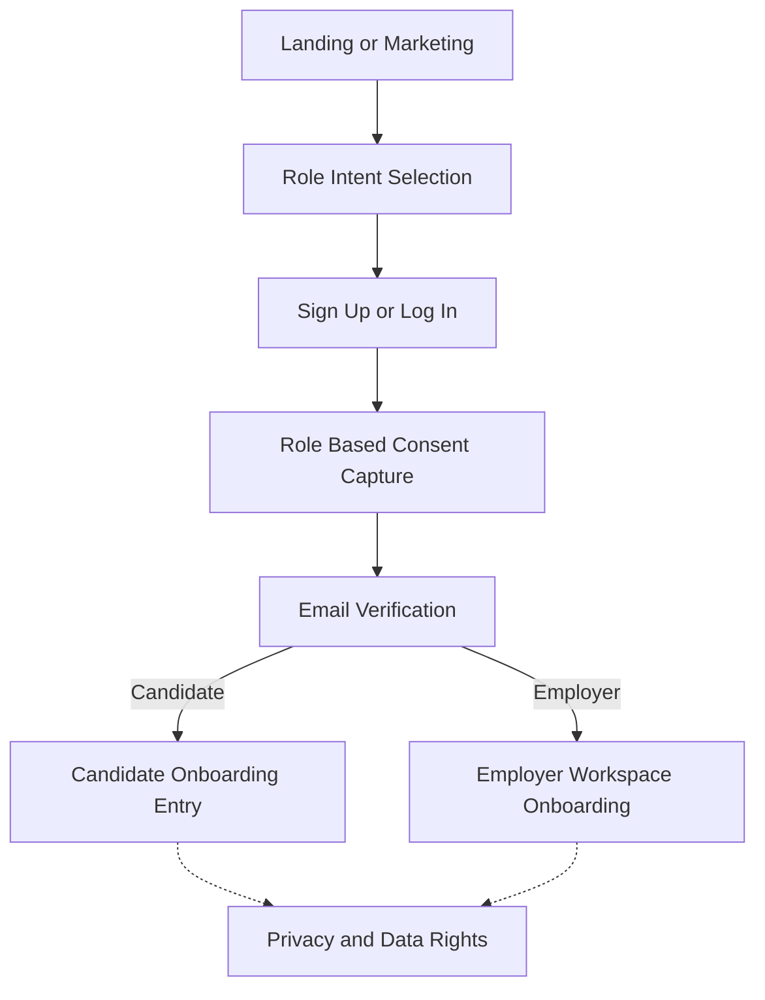
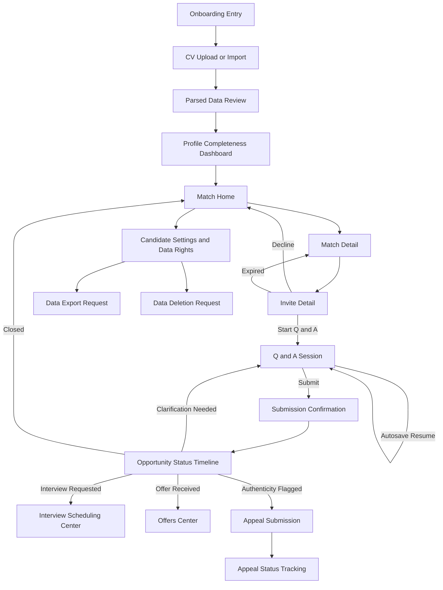
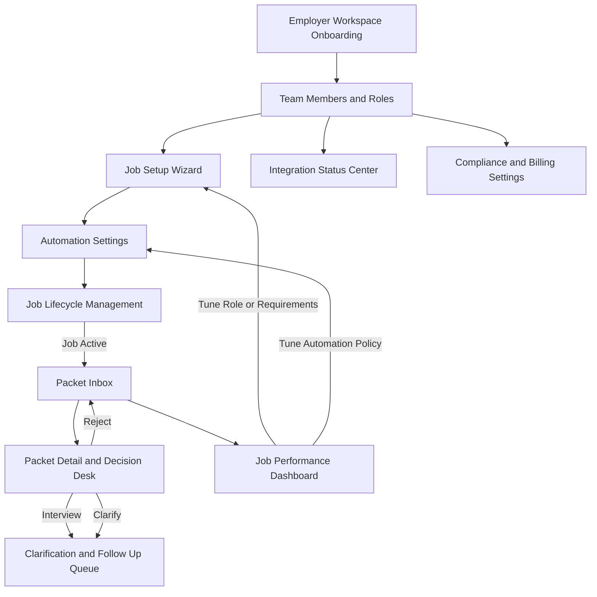
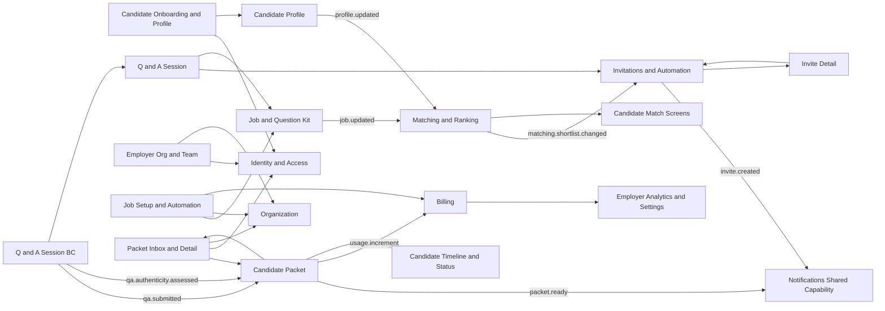

# Screen Connectivity Maps

This file contains Mermaid-safe diagrams for the main product screen connections.

Source alignment:
- `Plan/03_user_experience_flows/03_candidate_user_flow.md`
- `Plan/03_user_experience_flows/04_employer_user_flow.md`
- `Plan/03_user_experience_flows/05_end_to_end_golden_flow.md`
- `Plan/03_user_experience_flows/15_ui_screen_inventory_mvp.md`
- `Plan/02_architecture/03_bounded_contexts_mvp.md`
- `Plan/02_architecture/04_bc_interfaces_conceptual.md`

---

## 1) Global Entry and Shared Layer

---

## 2) Candidate App Map

---

## 3) Employer App Map

---

## 4) Architecture Aware Integration Map

---

## Rendering Notes

- Open this file in Markdown Preview for the most reliable Mermaid rendering.
- If any diagram fails in your environment, split it into smaller blocks and keep labels simple ASCII.

---

## Non Mermaid Fallback Map

Use this section if Mermaid rendering is disabled in your editor.

### Global Entry and Shared Layer

`Landing or Marketing`
-> `Role Intent Selection`
-> `Sign Up or Log In`
-> `Role Based Consent Capture`
-> `Email Verification`
-> Candidate path: `Candidate Onboarding Entry`
-> Employer path: `Employer Workspace Onboarding`

Optional shared links from both paths:
- `Privacy and Data Rights`

### Candidate App Flow

`Onboarding Entry`
-> `CV Upload or Import`
-> `Parsed Data Review`
-> `Profile Completeness Dashboard`
-> `Match Home`
-> `Match Detail`
-> `Invite Detail`

From `Invite Detail`:
- Start: -> `Q and A Session`
- Decline: -> `Match Home`
- Expired: -> `Match Detail`

From `Q and A Session`:
- Submit: -> `Submission Confirmation` -> `Opportunity Status Timeline`
- Resume path: `Q and A Session` -> `Q and A Session`

From `Opportunity Status Timeline`:
- Interview requested: -> `Interview Scheduling Center`
- Offer received: -> `Offers Center`
- Clarification needed: -> `Q and A Session`
- Closed: -> `Match Home`
- Authenticity flagged: -> `Appeal Submission` -> `Appeal Status Tracking`

From `Match Home`:
- -> `Candidate Settings and Data Rights`
  - -> `Data Export Request`
  - -> `Data Deletion Request`

### Employer App Flow

`Employer Workspace Onboarding`
-> `Team Members and Roles`
-> `Job Setup Wizard`
-> `Automation Settings`
-> `Job Lifecycle Management`
-> (if active) `Packet Inbox`
-> `Packet Detail and Decision Desk`

From `Packet Detail and Decision Desk`:
- Interview: -> `Clarification and Follow Up Queue`
- Clarify: -> `Clarification and Follow Up Queue`
- Reject: -> `Packet Inbox`

From `Packet Inbox`:
- -> `Job Performance Dashboard`
  - Tune role or requirements: -> `Job Setup Wizard`
  - Tune automation policy: -> `Automation Settings`

From `Team Members and Roles`:
- -> `Integration Status Center`
- -> `Compliance and Billing Settings`

### Architecture Aware Integration (BC linked)

Sync checks and reads:
- Candidate onboarding and profile screens -> `Identity and Access`, `Candidate Profile`
- Employer org and team screens -> `Identity and Access`, `Organization`
- Job setup and automation screens -> `Job and Question Kit`, `Organization`, `Billing`
- Invite detail -> `Invitations and Automation`
- Q and A session -> `Invitations and Automation`, `Job and Question Kit`
- Packet inbox and detail -> `Candidate Packet`, `Identity and Access`, `Organization`

Async event flow:
- `Candidate Profile` -profile.updated-> `Matching and Ranking`
- `Job and Question Kit` -job.updated-> `Matching and Ranking`
- `Matching and Ranking` -matching.shortlist.changed-> `Invitations and Automation`
- `Invitations and Automation` -invite.created-> `Notifications Shared Capability`
- `Q and A Session BC` -qa.submitted-> `Candidate Packet`
- `Q and A Session BC` -qa.authenticity.assessed-> `Candidate Packet`
- `Candidate Packet` -packet.ready-> `Notifications Shared Capability`
- `Candidate Packet` -usage.increment-> `Billing`
